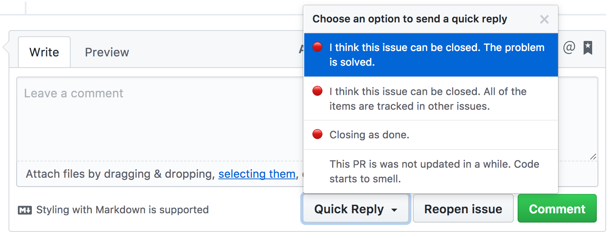

# Quick Reply for GitHub

For any GitHub issue or PR, this browser extension provides a "Quick Reply" button:

- I think this issue can be closed. The problem is solved.
- I think this issue can be closed. All of the items are tracked in other issues.
- Closing as done.
- This PR seems stale. Please consider what can be done to finish it.

## Get it on

### [Chrome Web Store](https://chrome.google.com/webstore/detail/quick-reply-for-github/keofnoohmbfdpekbhahcnggkddgkefci)

### [Add-ons for Firefox](https://addons.mozilla.org/en-US/firefox/addon/quick-reply-for-github-2/)

## Screenshot

