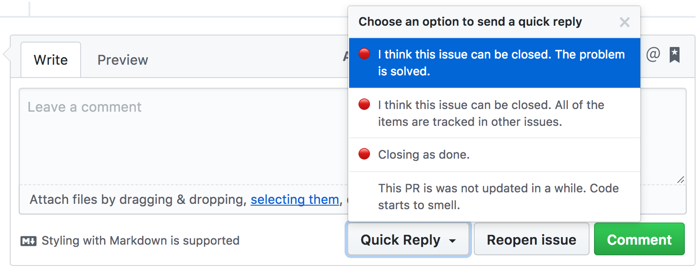

# Quick Reply

A Chrome and Firefox extension for GitHub

For any GitHub issue or PR, this extension provides a button "Quick Reply":

- I think this issue can be closed. The problem is solved.
- I think this issue can be closed. All of the items are tracked in other issues.
- Closing as done.
- This PR seems stale. Please consider what can be done to finish it.

## Screenshot

